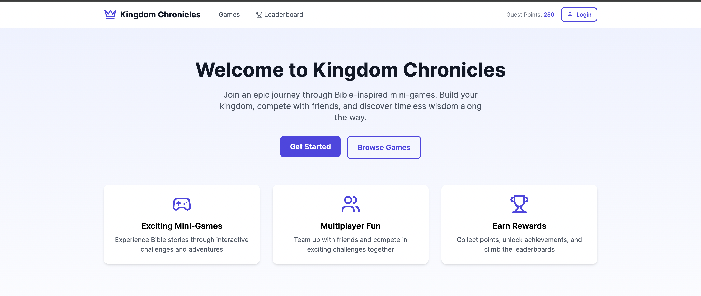
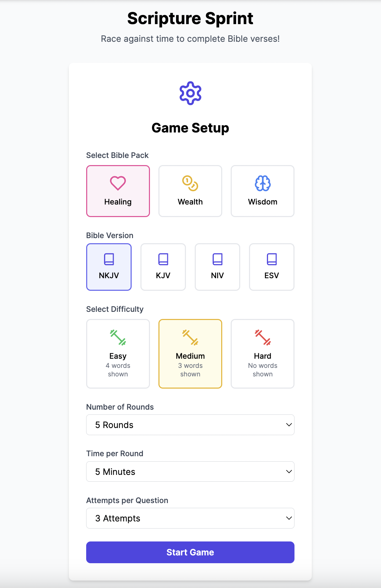
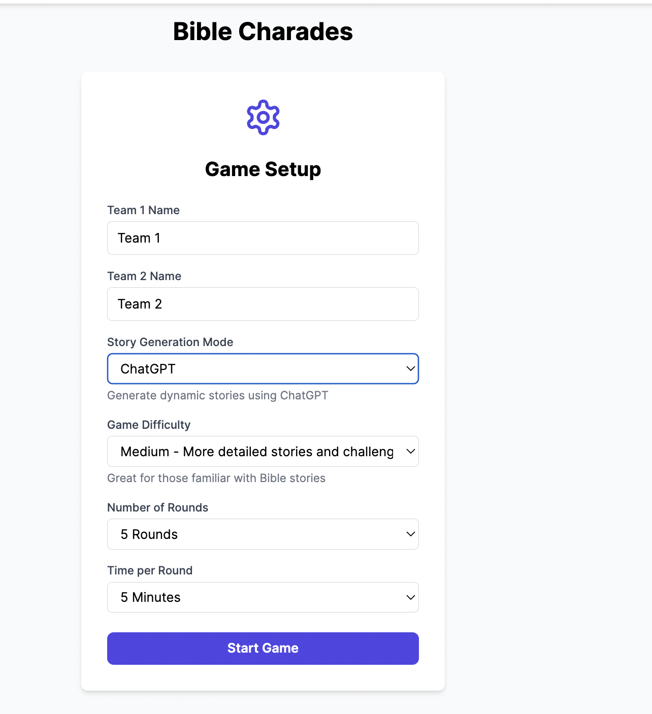
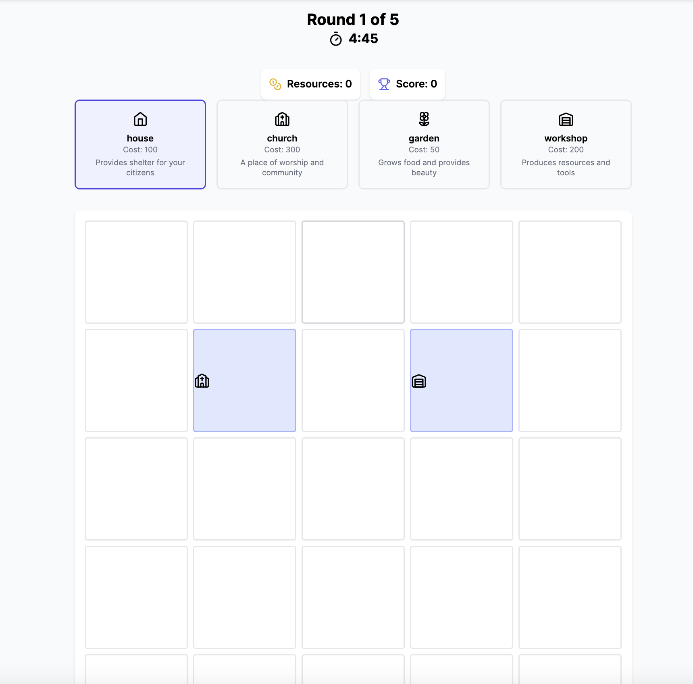
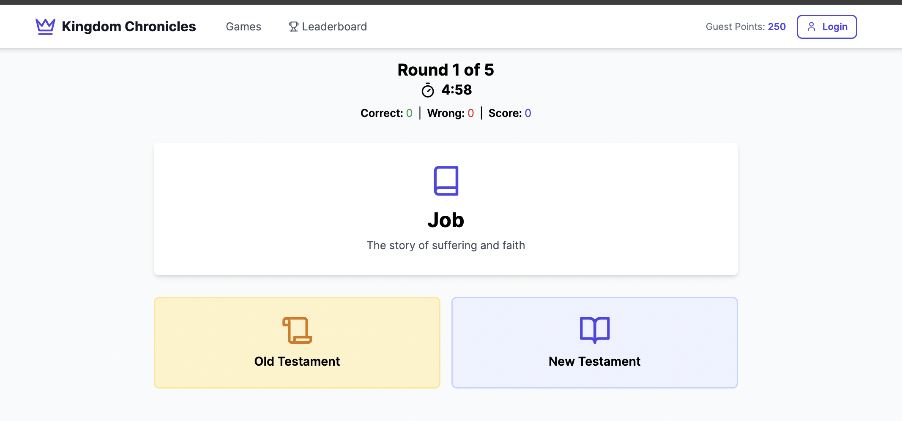

# Kingdom Chronicles

A Bible-themed gaming platform featuring multiple interactive games designed to make learning Scripture engaging and fun.


*Add a screenshot of your home page here*

## 🎮 Featured Games

### 1. Scripture Sprint
Race against time to complete Bible verses from different themed packs (Healing, Wealth, Wisdom).


*Add a screenshot of Scripture Sprint gameplay*

Features:
- Multiple Bible versions (KJV, NKJV, NIV, ESV)
- Different difficulty levels
- Themed verse packs
- Score tracking and leaderboards

### 2. Bible Charades
Act out and guess Biblical stories in this exciting team game.


*Add a screenshot of Bible Charades*

Features:
- Team-based gameplay
- Dynamic story generation
- Multiple difficulty levels
- Built-in timer

### 3. Kingdom Builders
Build and manage your Biblical kingdom with wisdom and strategy.


*Add a screenshot of Kingdom Builders*

Features:
- Resource management
- Strategic building placement
- Score multipliers for adjacent buildings
- Multiple rounds of gameplay

### 4. Testament Quiz
Test your knowledge of Old and New Testament books.


*Add a screenshot of Testament Quiz*

Features:
- Quick-fire rounds
- Detailed book descriptions
- Progressive difficulty
- Score tracking

## 🚀 Getting Started

### Prerequisites
- Node.js 18 or higher
- npm or yarn

### Installation

1. Clone the repository:
```bash
git clone https://github.com/Kingdom-Chronicles/kingdom-chronicles.git
```

2. Install dependencies:
```bash
cd kingdom-chronicles
npm install
```

3. Create a `.env` file based on `.env.example`:
```bash
cp .env.example .env
```

4. Start the development server:
```bash
npm run dev
```

## 🛠️ Built With

- [React](https://reactjs.org/) - Frontend framework
- [Vite](https://vitejs.dev/) - Build tool
- [TypeScript](https://www.typescriptlang.org/) - Type safety
- [Tailwind CSS](https://tailwindcss.com/) - Styling
- [AWS Amplify](https://aws.amazon.com/amplify/) - Backend services
- [Framer Motion](https://www.framer.com/motion/) - Animations
- [Lucide Icons](https://lucide.dev/) - Icon set

## 📱 Features

### User Management
- User registration and authentication
- Guest play support
- Score tracking and persistence
- Achievement system

### Game Features
- Multiple game modes
- Difficulty settings
- Real-time scoring
- Leaderboards
- Team play support
- Progress tracking

### Technical Features
- Responsive design
- Offline support
- Cross-browser compatibility
- Performance optimized
- Type-safe codebase

## 🎯 Game Modes

### Single Player
- Scripture Sprint
- Testament Quiz
- Kingdom Builders
- Ark Escape

### Multiplayer
- Bible Charades (2-12 players)
- Team competitions

## 🏆 Scoring System

- Points for correct answers
- Time bonuses
- Combo multipliers
- Achievement bonuses
- Global leaderboard

## 🔒 Security

- AWS Cognito authentication
- Row-level security
- API key protection
- Secure data storage

## 📈 Analytics

- Game performance tracking
- User engagement metrics
- Feature usage analytics
- Error tracking

## 🤝 Contributing

1. Fork the repository
2. Create your feature branch (`git checkout -b feature/AmazingFeature`)
3. Commit your changes (`git commit -m 'Add some AmazingFeature'`)
4. Push to the branch (`git push origin feature/AmazingFeature`)
5. Open a Pull Request to the `develop` branch
6. Include a demo video in your Pull Request to showcase the feature or fix

### Demo Video Guidelines
- Keep it short and focused on the changes.
- Highlight key features or fixes.
- Use screen recording tools like awesome screenshot or screencastify.

## 📝 License

This project is licensed under the MIT License - see the [LICENSE.md](LICENSE.md) file for details.

## 👥 Authors

- Your Name - *Initial work* - [YourGithub](https://github.com/yourusername)

## 🙏 Acknowledgments

- Bible API providers
- Open source contributors
- Testing team members
- Community feedback

## 📞 Support

For support, email masikotimo@gmail.com or join our Discord server.

## 🗺️ Roadmap

- [ ] Additional game modes
- [ ] Mobile app version
- [ ] Multiplayer improvements
- [ ] More Bible translations
- [ ] Advanced analytics
- [ ] Social features


# Mobile App Assets

This directory contains the image assets needed for the mobile app version of Kingdom Chronicles.

## Splash Screen
URL: https://images.unsplash.com/photo-1507842217343-583bb7270b66?q=80&w=2400
- A beautiful, high-resolution image of an open Bible with soft lighting
- Dimensions: 2400x2400px (1:1 ratio)
- Used for the initial loading screen
- Provides immediate visual context for the app's biblical theme

## Favicon
URL: https://images.unsplash.com/photo-1533000971552-6a962ff0b9f9?q=80&w=192
- A simplified crown icon in gold/yellow on a deep blue background
- Dimensions: 192x192px
- Used for browser tabs and bookmarks
- Matches the app's "Kingdom" theme

## Adaptive Icon
URL: https://images.unsplash.com/photo-1578165219176-ece04edbd053?q=80&w=1024
- A crown symbol with a gradient background
- Foreground Layer: Crown icon in gold (#FFD700)
- Background Layer: Gradient from deep blue (#1E3A8A) to royal purple (#5B21B6)
- Dimensions: 1024x1024px
- Adaptive shape support for different Android versions

## App Icon
URL: https://images.unsplash.com/photo-1516912481808-3406841bd33c?q=80&w=512
- A stylized crown with a scroll design
- Dimensions: 512x512px
- Recognizable at small sizes
- Matches the app's branding

## Usage Guidelines

1. Splash Screen:
   - Center the app logo and name
   - Use a subtle fade transition
   - Keep text minimal

2. Favicon:
   - Ensure it's recognizable at 16x16px
   - Use simple shapes and high contrast

3. Adaptive Icon:
   - Test on different Android shapes (circle, square, rounded square)
   - Maintain safe zone in center 66% of the image
   - Use vector assets when possible

4. App Icon:
   - Test visibility on both light and dark backgrounds
   - Ensure readability at small sizes
   - Follow platform-specific guidelines (iOS/Android)

## Image Specifications

### iOS Requirements:
- App Icon: 1024x1024px (App Store)
- Spotlight: 40x40px, 80x80px, 120x120px
- Settings: 29x29px, 58x58px, 87x87px
- App Icon: 60x60px, 120x120px, 180x180px

### Android Requirements:
- Play Store: 512x512px
- Adaptive Icon: 108x108px - 432x432px
- Legacy Icon: 48x48px - 192x192px

## Color Palette

Primary Colors:
- Royal Blue: #1E40AF
- Deep Purple: #5B21B6
- Gold: #FFD700

Accent Colors:
- Light Blue: #60A5FA
- Light Purple: #A78BFA
- Light Gold: #FDE68A

## Implementation Notes

1. For iOS:
   ```xml
   <key>UILaunchStoryboardName</key>
   <string>LaunchScreen</string>
   ```

2. For Android:
   ```xml
   <adaptive-icon>
     <background>@drawable/ic_launcher_background</background>
     <foreground>@drawable/ic_launcher_foreground</foreground>
   </adaptive-icon>
   ```

3. For Web:
   ```html
   <link rel="icon" type="image/png" href="/favicon.png">
   <link rel="apple-touch-icon" href="/apple-touch-icon.png">
   ```
